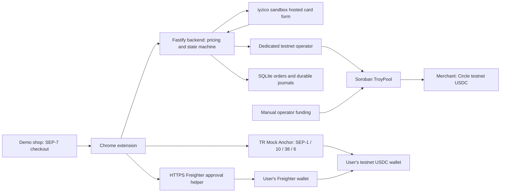

# Troia jury preview

## What to try

1. Visit https://troia-extension.vercel.app and download the ZIP. Extract it. In desktop Chrome, open `chrome://extensions`, enable Developer mode, choose **Load unpacked**, and select the extracted `troia-testnet` folder. Pin Troia. There is no Chrome Web Store listing yet.
2. Open https://troia-demo-store.vercel.app, read the test instructions, then enter `/shop`. Add a fictional product and choose **Pay with crypto / Stellar**. Troia detects its SEP-7 request.
3. Use the Troia banner to open the hosted iyzico **sandbox** form. Use the official Troy test card `9792072000017956`, a future expiry such as `12/2030`, CVC `123`, and name `Test User`. Never enter a real card. [Official reference](https://docs.iyzico.com/ek-bilgiler/test-kartlari).
4. Return to the store. The extension follows payment and onchain settlement and displays the transaction proof. Demo keys are placeholders; no product or email is delivered.
5. Separately, open **Bank transfers** in Troia. Connect Freighter on Stellar Testnet, prepare the wallet/trustline, request a quote, then create a deposit or withdrawal. Bank steps are simulated; USDC is transferred on testnet. **The shared mock anchor currently has a SEP-6 settlement incident. Pending transfers are not successful and must not be sent twice.**

The card flow does not need a shopper wallet. The bank flow uses the user's Freighter wallet. Neither requires disclosing a secret key to Troia.

## Architecture



- **Extension:** validates supported asset/destination/amount, carries payment intent, follows status. Its separate bank panel discovers the anchor, verifies SEP-10 challenges, requests firm SEP-38 quotes, and uses SEP-6 exchange endpoints. Keys remain in Freighter.
- **Backend:** prices in TRY from independent sources, reserves pool liquidity, verifies card result, constructs a bounded Soroban payment and reconciles chain evidence. A session token and rate limits protect intent creation. The payment state machine and write-ahead journal handle retries and uncertain results.
- **TroyPool:** custodies test USDC, authenticates the operator, prevents replay, supports admin pause/rotation/upgrade. Soroban SDK 26; Stellar Testnet only.
- **Bookkeeping:** SQLite plus append-only evidence and double-entry journals. Drift checks remain enabled. A pool-scoped exclusive writer lock prevents a refill-booking tool and server from writing concurrently.
- **Anchor:** hackathon-provided TR Mock Anchor, not a BiLira production integration. Bank and KYC steps are simulated. A green health endpoint does not prove transfers are settling.

## Decisions and tradeoffs

The extension is the product; the two sites introduce it and provide an independent shopping demo. The `/wallet` helper exists because a normal web page can request Freighter approval; it is not a replacement dashboard. Replies must match the helper origin, path, top-level tab and random request ID.

Card payments and bank deposits are distinct. A customer's anchor deposit never automatically replenishes the operator's pool. Manual funding uses the same testnet USDC issuer as the anchor, with verified receipt bookkeeping. No issuer key or simulated mint is needed in the default mode.

The current implementation is custodial on the merchant-settlement leg. The administrator and operator are trusted roles, not a trustless bridge. The product is not ready for real cards/mainnet without PSP onboarding, financial/compliance work and a separate security audit. Browser-local withdrawal markers do not prevent cross-device repeats.

## Run and verify

Requirements: Node 24+, pnpm 11, desktop Chrome; Freighter for the bank flow. Rust and Stellar CLI are required to build/test contracts.

```sh
pnpm install --frozen-lockfile
pnpm build
pnpm test
cargo test -p troy_pool
stellar contract build
node scripts/wire-apps.mjs
cd app/extension && npm ci && npm test -- --run && npm run build
```

Build each website separately with `npm ci && npm run build` in `app/storefront` and `app/gamestore`. A local checkout uses `npm run dev`; its public configuration remains pinned to the deployed testnet services unless you generate from a separate local deployment record.

Copy `.env.example` into a local ignored environment file and supply your own sandbox credentials and authorized testnet operator key. On this development machine `.env.anchor` runs the new preview; `.env` belongs to the preserved older demo. Do not upload either.

```sh
node --env-file=.env.anchor scripts/preflight.mjs
node --env-file=.env.anchor packages/composition/dist/main.js
```

The new preview binds to `127.0.0.1:3001` here. `/healthz` checks server startup, not every external dependency. Preflight checks the pool, fee account, price sources/history and PSP reachability. The completed live sandbox checkout is documented in [DEPLOYMENTS.md](DEPLOYMENTS.md).

## Public hosting

The static sites are on Vercel. The API is currently a temporary Cloudflare tunnel to this computer. **This is not yet unattended jury hosting.** VPS SSH information is needed. The Docker/Compose files are prepared but have not been tested or installed on a VPS.

Before starting the VPS instance, stop the local new-preview operator and migrate its complete pool data directory, including SQLite state and journals, while no writer is running. Never run two operators against the same pool, initialize a fresh journal over existing activity, or share the old demo's data with the new pool. Inspect existing VPS services/ports first. `compose.jury.yml` binds only localhost port 3001; connect an existing HTTPS reverse proxy rather than replacing other server services.

After changing the API upstream, rebuild public artifacts:

```sh
TROIA_API_UPSTREAM=https://your-backend-host node scripts/package-demo-sites.mjs
vercel link --yes --project troia-extension --cwd .deploy/intro
vercel deploy --prod --yes --cwd .deploy/intro
vercel link --yes --project troia-demo-store --cwd .deploy/demo
vercel deploy --prod --yes --cwd .deploy/demo
```

The packaging script copies only compiled assets and creates the extension ZIP. Vercel staging excludes environment files. `/api` is a stable public prefix; changing the backend upstream does not require users to reinstall the extension.

## Manual pool top-ups

1. Stop accepting new orders, let paid orders settle/book, then stop the new-preview backend. Preserve the data directory.
2. Transfer the configured Circle testnet USDC from the configured admin to the pool. Use Stellar Testnet and save the confirmed transaction hash. Never use `mint` for this external issuer.
3. Book the confirmed transfer with the operator tool, specifying its accounting value in TRY kurus:

```sh
node --env-file=.env.anchor packages/composition/dist/manual-topup.js TRANSFER_HASH VALUE_KURUS
```

The tool never signs. It verifies a successful RPC transaction and the exact SAC/admin/pool transfer event, rejects unrelated assets/transfers, rejects duplicate booking, and requires the onchain balance to equal the recorded balance plus this transfer. Any other unreconciled movement stops the operation. RPC has limited retention; book promptly. Initial funding is instead recorded once at first server boot as genesis.

4. Restart the backend. It loads reservation liquidity from chain. Confirm drift is zero. A `writer.lock` left by a crash must only be removed after verifying the recorded process is no longer alive.

## Submission checklist

- Submission deadline observed in Rise In: **20 September 2026, 23:59 GMT+3**.
- Select the correct Genesis/Scale track before submitting; the form says it cannot be changed. Scale is invitation-only.
- Connect GitHub in Rise In and select the public repository with this updated source. No submission has been made by the agent.
- Use the public demo and project links above. Complete VPS hosting for uninterrupted access.
- Provide the public pitch-deck link. The official template link in the viewed task was still **TBD**; obtain it rather than claiming a custom deck is the official template.
- Summary field: at most 2000 characters, plain text.
- Include current testnet contract IDs and accurate architecture. Do not claim a real BiLira agreement/integration, production bank settlement, or mainnet readiness.
- References used: [TR Mock Anchor guide](https://tr-mock-anchor.fly.dev/guide), [Stellar anchor integration skill](https://github.com/CheesecakeLabs/stellar-anchor-skill), official iyzico test-card documentation.

## Roadmap

Recover/retest the shared anchor integration; deploy persistent jury infrastructure; test cross-device recovery and review security; validate real PSP/anchor onboarding and compliance; replace manual liquidity operations after measured pilot results. SCF or InstAward is a possible next application, not an awarded grant or guaranteed partnership.

## Plain-text submission summary draft

Troia is a Chrome extension that lets Turkish shoppers pay a supported Stellar checkout with a Troy card while the merchant receives USDC. A separate bank-transfer panel connects a user's Freighter wallet to TR Mock Anchor for quoted TRY deposits and USDC withdrawals.

The card path uses an iyzico sandbox form and a Soroban settlement pool on Stellar Testnet. The backend reserves liquidity, tracks payment state, prevents duplicate payouts and reconciles signed evidence against the chain. Both paths now use Circle testnet USDC; pool replenishment is an explicit manual operator action, separate from customer deposits. The anchor panel uses SEP-1, SEP-10, SEP-38 and SEP-6 exchange flows with expiring quotes and transaction-status recovery.

Judges can install the unpacked extension from our introduction site and try a fictional product purchase in our separate demo shop. A sandbox card payment settling 0.50 test USDC to the merchant has been verified onchain. No real money or product delivery is involved. The shared mock anchor currently has a settlement outage, so its new end-to-end re-test is pending. The API currently uses a development tunnel and awaits permanent VPS hosting. Current contract IDs, evidence, setup instructions and limitations are documented in the repository.
